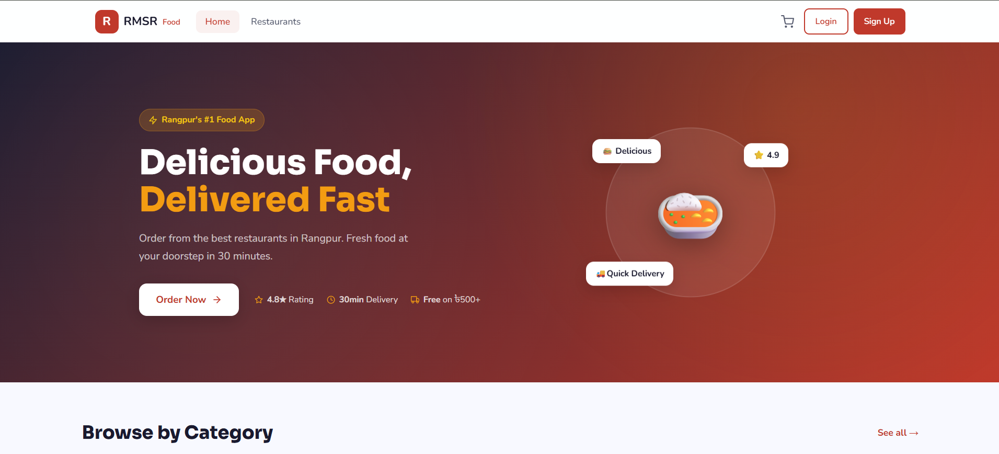

# RMSR — Food Ordering & Delivery Platform

A full-stack food ordering and delivery platform built for the BRUR community in Rangpur, Bangladesh.

RMSR provides a complete digital ordering workflow connecting customers, restaurants, riders, and administrators through a single platform.

### 🌐 Live Platform

**Live Demo:** https://rmsr-food.vercel.app/

### 📦 Source Code

**GitHub:** https://github.com/Rakibul-Islam-Rahat/rmsr

### ✨ Highlights

- Full-stack MERN application
- Customer, restaurant, rider, and admin portals
- Real-time order updates and communication using Socket.IO
- Online payment integration with SSLCommerz
- GPS-based rider location sharing
- Push notifications using Firebase Cloud Messaging
- Email notifications
- Cloudinary image storage
- AI-powered food recommendations
- SEO optimized and publicly deployed
- Search visibility for the query **"BRUR food"**

---
## 📸 Platform Preview

